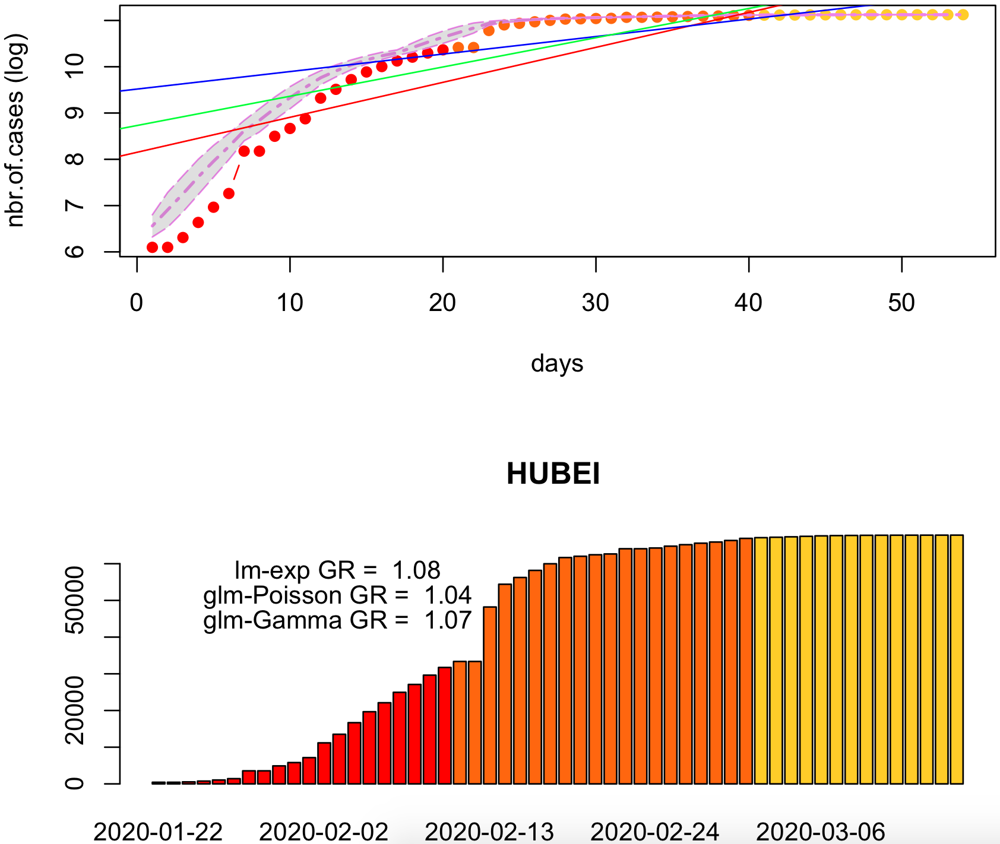
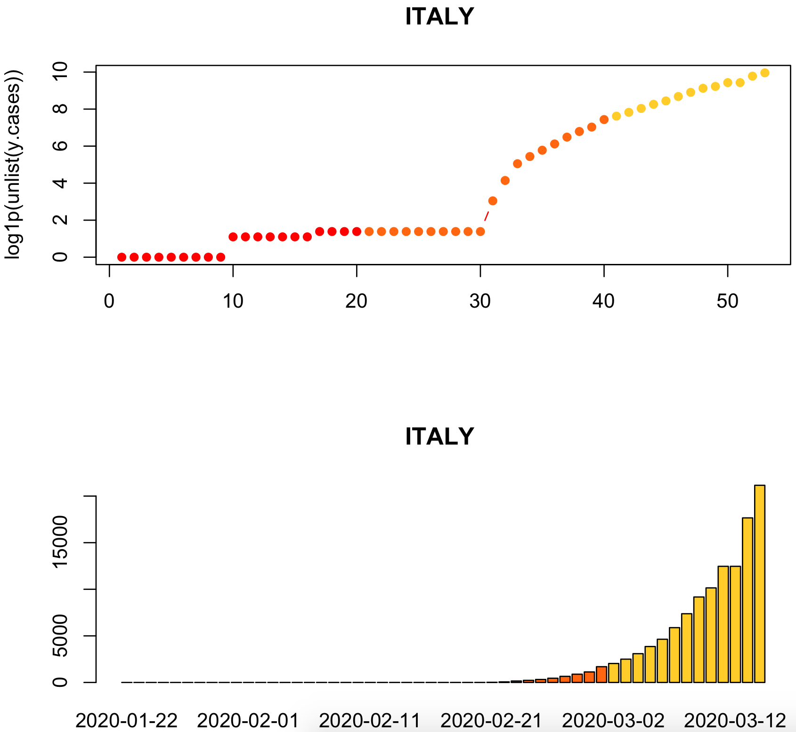
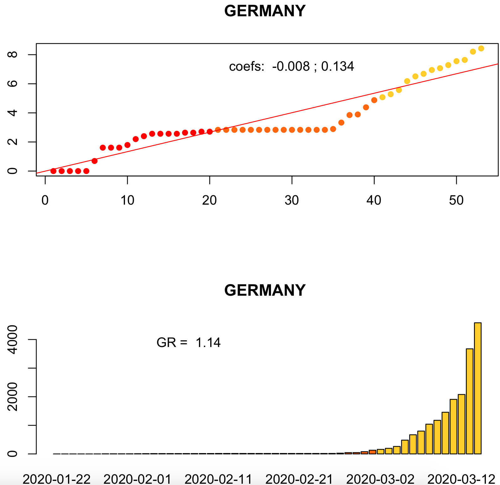
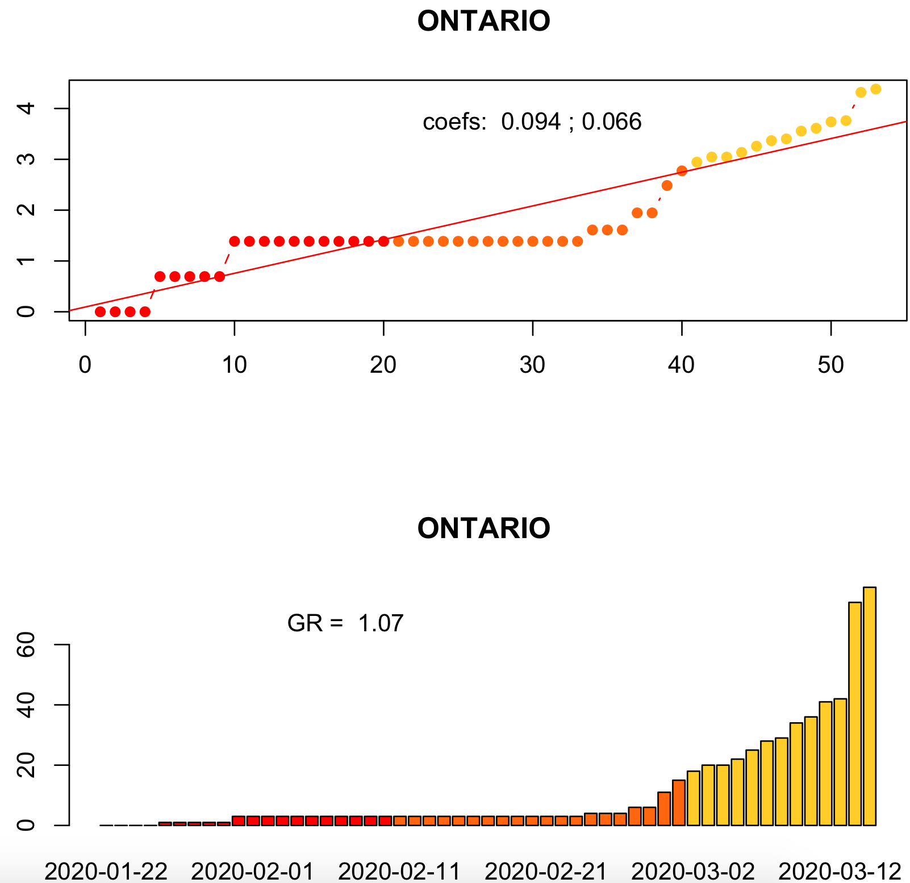

# COVID19.Analytics

## Introduction
The "covid19.analytics" R package allows users to obtain live\* worldwide data from the
*novel CoronaVirus Disease* originally reported in 2019, CoViD-19, as published by the
JHU CCSE repository [1], as well as, provide basic analysis tools and functions to
investigate these datasets.

The goal of this package is to make the latest data promptly available
to researchers and the scientific community.

<object data="man/figures/livemap.html" width="105%" height="525"></object>

### Data Accessibility
The `covid19.data()` function allows users to obtain realtime data about the CoViD19 reported cases
from the JHU's CCSE repository, in the following modalities:
* "aggregated" data for the latest day, with a great 'granularity' of geographical regions (ie. cities, provinces, states, countries)
* "time series" data for larger accumulated geographical regions (provinces/countries)

* "deprecated": we also include the original data style in which these datasets were reported initially.

The datasets also include information about the different categories (status) "confirmed"/"deaths"/"recovered"
of the cases reported daily per country/region/city.

This data-acquisition function, will first attempt to retrieve the data directly
from the JHU repository with the latest updates.
If for what ever reason this fails (eg. problems with the connection) the package
will load a preserved "image" of the data which is **not** the latest one but it
will still allow the user to explore this older dataset.
In this way, the package offers a more robust and resilient approach to the quite
dynamical situation with respect to data availability and integrity.


#### Data retrieval options
<!--
 |    argument    |   description  |
 |----------------|----------------|
 | `aggregated`   |  latest number of cases *aggregated* by country |
 **Time Series data**
 | `ts-confirmed` |  time series data of confirmed cases |
 | `ts-deaths`    |  time series data of fatal cases |
 | `ts-recovered` |  time series data of recovered cases |
 | `ts-ALL`       |  all time series data combined |
 **Deprecated data formats**
 | `ts-dep-confirmed` | time series data of confirmed cases as originally reported (deprecated) |
 | `ts-dep-deaths`    | time series data of deaths as originally reported (deprecated) |
 | `ts-dep-recovered` | time series data of recovered cases as originally reported (deprecated)|
 **Combined**
 | `ALL`          | all of the above |
-->

<!------- TABLE ------>
<table style="width:100%">
  <tr>
    <th>argument</th>
    <th>description</th> 
  </tr>
  <tr>
    <td> <code>aggregated</code> </td>
    <td> latest number of cases <i>aggregated</i> by country </td>
  </tr>
  <tr>
    <th colspan="2"> <b>Time Series data</b> </th>
  </tr>
  <tr>
    <td> <code>ts-confirmed</code> </td>
    <td> time series data of confirmed cases </td> 
  </tr>
  <tr>
    <td> <code>ts-deaths</code> </td>
    <td> time series data of fatal cases </td> 
  </tr>
  <tr>
    <td> <code>ts-recovered</code> </td>
    <td> time series data of recovered cases </td>
  </tr>
  <tr>
    <td> <code>ts-ALL</code> </td>
    <td> all time series data combined </td>
  </tr>
  <tr>
    <th colspan="2"> <b>Deprecated data formats</b> </th>
  </tr>
  <tr>
   <td> <code>ts-dep-confirmed</code> </td>
   <td> time series data of confirmed cases as originally reported (deprecated) </td>
  </tr>
  <tr>
   <td> <code>ts-dep-deaths</code> </td>
   <td> time series data of deaths as originally reported (deprecated) </td>
 </tr>
 <tr>
   <td> <code>ts-dep-recovered</code> </td>
   <td> time series data of recovered cases as originally reported (deprecated) </td>
 </tr>
 <tr>
  <th colspan="2"> <b>Combined</b> </th>
 </tr>
 <tr>
  <td> <code>ALL</code> </td>
  <td> all of the above </td>
 </tr>
</table>
<!------- TABLE ------>


### covid19-Sequencing data
The `covid19.genomic.data()` allows users to obtain the covid19's genomic sequencing data from NCBI [2].


### Analytical & Graphical Indicators
In addition to the access and retrieval of the data, the package includes some
basics functions to estimate totals per regions/country/cities, growth rates
and daily changes in the reported number of cases.


### Experimental: Modelling the evolution of the Virus spread
We are working in the development of *modelling* capabilities.
A preliminary prototype has been included and can be accessed using the `generate.SIR.model` function, which implements a simple SIR (*Susceptible-Infected-Recovered*) ODE model using the actual data of the virus.


### Further Features
We will continue working on adding and developing new features to the package,
in particular modelling and predictive capabilities.


### Summary of the Functions from the "covid19.analytics" Package
<!--
 | Function  | description |
 | --------	 | ----------- |
 **Data Acquisition**
 | `covid19.data` |  obtain live\* worldwide data for covid19 virus, from the JHU's CCSE repository [1]
 **Analysis**
 | `report.summary`  |  summarize the current situation, will download the latest data and summarize different quantities
 | `tots.per.location`  |  compute totals per region and plot time series for that specific region/country
 | `growth.rate`  |  compute changes and growth rates per region and plot time series for that specific region/country
 **Graphics**
 | `totals.plt`   |  plots in a static and interactive plot total number of cases per day
 | `live.map`     |  generates an interactive map displaying cases around the world
 **Modelling**
 | `generate.SIR.model`  |  generates a SIR (Susceptible-Infected-Recovered) model
-->

<!------- TABLE ------>
<table style="width:100%">
  <tr>
    <th> Function </th>
    <th> Description </th>
    <th> Main Type of Output</th>
  </tr>
  <tr>
   <th colspan="3"> <b>Data Acquisition</b> </th>
  </tr>
  <tr>
    <td> <code>covid19.data</code> </td>
    <td> obtain live* worldwide data for covid19 virus, from the JHU's CCSE repository [1] </td>
    <td> return dataframes/list with the collected data </td>
  </tr>
 <tr>
  <td> <code>covid19.genomic.data</code> </td>
  <td> obtain covid19's genomic sequencing data from NCBI [2] </td>
  <td> list, with the RNA seq data in the <code>"$NC_045512.2"</code> entry </td>
 </tr>
  <tr>
   <th colspan="3"> <b>Analysis</b> </th>
  </tr>
  <tr>
    <td> <code>report.summary</code> </td>
    <td> summarize the current situation, will download the latest data and summarize different quantities </td>
    <td> on screen table and static plots (pie and bar plots) with reported information, can also output the tables into a text file</td>
  </tr>
  <tr>
   <td> <code>tots.per.location</code> </td>
   <td> compute totals per region and plot time series for that specific region/country </td>
   <td> static plots: data + models (exp/linear, Poisson, Gamma), mosaic and histograms when more than one location are selected </td>
  </tr>
  <tr>
   <td> <code>growth.rate</code> </td>
   <td> compute changes and growth rates per region and plot time series for that specific region/country </td>
   <td> static plots: data + models (linear,Poisson,Exp), mosaic and histograms when more than one location are selected </td>
  </tr>
  <tr>
   <th colspan="3">Graphics and Visualization</th>
 </tr>
  <tr>
   <td> <code>total.plts</code> </td>
   <td> plots in a static and interactive plot total number of cases per day </td>
   <td> static and interactive plot </td>
 </tr>
  <tr>
   <td> <code>live.map</code> </td>
   <td> generates an interactive map displaying cases around the world </td>
   <td> static and interactive plot </td>
  </tr>
  <tr>
   <th colspan="3">Modelling</th>
 </tr>
  <tr>
   <td> <code>generate.SIR.model</code> </td>
   <td> generates a SIR (Susceptible-Infected-Recovered) model </td>
   <td> list containing the fits for the SIR model </td>
 </tr>
  <tr>
   <td> <code>plot.SIR.model</code> </td>
   <td> plot the results from the SIR model </td>
   <td> static and interactive plots </td>
 </tr>
</table>
<!------- TABLE ------>

## Installation
For using the "covi19.analytics" package, first you will need to install it.

The stable version can be downloaded from the CRAN repository:
```R
install.packages("covid19.analytics")
```

To obtain the development version you can get it from the github repository, i.e.
```R
# need devtools for installing from the github repo
install.packages("devtools")

# install bioC.logs
devtools::install_github("mponce0/covid19.analytics")
```

For using the package, either the stable or development version, just load it using the library function:
```R
# load "covid19.analytics"
library(covid19.analytics)
```


## Examples

### Reading data
```R
# obtain all the records combined for "confirmed", "deaths" and "recovered" cases -- *aggregated* data
 covid19.data.ALLcases <- covid19.data()

# obtain time series data for "confirmed" cases
 covid19.confirmed.cases <- covid19.data("ts-confirmed")

# reads all possible datasets, returning a list
 covid19.all.datasets <- covid19.data("ALL")

# reads the latest aggregated data
 covid19.ALL.agg.cases <- covid19.data("aggregated")

# reads time series data for casualties
 covid19.TS.deaths <- covid19.data("ts-deaths")
```

Read covid19's genomic data 
```R
# obtain covid19's genomic data
 covid19.gen.seq <- covid19.genomic.data()

# display the actual RNA seq
 covid19.gen.seq$NC_045512.2
```


### Some basic analysis
#### Summary Report
```R
# a quick function to overview top cases per region for time series and aggregated records
report.summary()

# save the tables into a text file named 'covid19-SummaryReport_CURRENTDATE.txt' where CURRRENTDATE is the actual date
report.summary(saveReport=TRUE)
```

<p>
  
  
</p>


#### Totals per Country/Region/Province
```R
# totals for confirmed cases for "Ontario"
tots.per.location(covid19.confirmed.cases,geo.loc="Ontario")

# total for confirmed cases for "Canada"
tots.per.location(covid19.confirmed.cases,geo.loc="Canada")

# total nbr of deaths for "Mainland China"
tots.per.location(covid19.TS.deaths,geo.loc="China")

# total nbr of confirmed cases in Hubei including a confidence band based on moving average
tots.per.location(covid19.confirmed.cases,geo.loc="Hubei", confBnd=TRUE)
```


<object data="man/figures/Hubei_totals.pdf" type="application/pdf" width="450px">
 <embed src="https://github.com/mponce0/covid19.analytics/blob/master/man/figures/Hubei_totals.pdf">
 </embed>
</object>
<object data="man/figures/Italy_totals.pdf" type="application/pdf" width="450px">
 <embed src="https://github.com/mponce0/covid19.analytics/blob/master/man/figures/Italy_totals.pdf"> 
 </embed>
</object>
<object data="man/figures/Germany_totals.pdf" type="application/pdf" width="450px">
 <embed src="https://github.com/mponce0/covid19.analytics/blob/master/man/figures/Germany_totals.pdf">
 </embed>
</object>
<object data="man/figures/Ontario_totals.pdf" type="application/pdf" width="450px">
 <embed src="https://github.com/mponce0/covid19.analytics/blob/master/man/figures/Ontario_totals.pdf">
<!--
<p>
  
  
  
  
</p>
-->
  <p>
  Images available <a href="https://github.com/mponce0/covid19.analytics/tree/master/man/figures/">here</a> 
 </p>
 </embed>
</object>

<!--
<p>
  
  
  
  
</p>
-->


The figures show the total number of cases for different cities (provinces/regions) and countries:
one the upper plot in log-scale with a linear fit to an exponential law and in linear scale in the bottom panel.
Details about the models are included in the plot, in particular the *growth rate* which in several cases appears to be around 1.2+ as predicted by some models.
Notice that in the case of Hubei, the values is closer to 1, as the dispersion of the virus has reached its logistic asymptote while in other cases (e.g. Germany and Italy --for the presented dates--) is still well above 1, indicating its exponential growth.


**IMPORTANT** Please notice that the "linear exponential" modelling function implements a *simple (naive)* and straight-forward linear regression model, which is **not** optimal for exponential fits.
The reason is that the errors for large values of the dependent variable weight much more than those for small values when apply the exponential function to go back to the original model.
Nevertheless for the sake of a quick interpretation is OK, but one should bare in mind the implications of this simplification.


We also provide two additional models, as shown in the figures above, using the Generalized Linear Model `glm()` function, using a *Poisson* and *Gamma* family function.
In particular, the `tots.per.location` function will determine when is possible to automatically generate each model and display the information in the plot as well as details of the models in the console.


```R
# read the time series data for all the cases
all.data <- covid19.data('ts-ALL')

# run on all the cases
tots.per.location(all.data,"Japan")
```
<p>
  
  
  
</p>


It is also possible to run the `tots.per.location` (and `growth.rate`) functions,
on the whole data set, for which a quite large but complete mosaic figure will
be generated, e.g.
```R
# total for death cases for "ALL" the regions
tots.per.location(covid19.TS.deaths)

# or just
tots.per.location(covid19.data("ts-confirmed"))
```


#### Growth Rate
```R
# read time series data for confirmed cases
TS.data <- covid19.data("ts-confirmed")

# compute changes and growth rates per location for all the countries
growth.rate(TS.data)

# compute changes and growth rates per location for 'Italy'
growth.rate(TS.data,geo.loc="Italy")

# compute changes and growth rates per location for 'Italy' and 'Germany'
growth.rate(TS.data,geo.loc=c("Italy","Germany"))
```

<p>
  
  
  
  
</p>

The previous figures show on the upper panel the number of changes on a daily basis in linear scale (thin line, left y-axis) and log scale (thicker line, right y-axis), while the bottom panel displays the growth rate for the given country/region/city.


Combining multiple geographical locations:
```R
# obtain Time Series data
TSconfirmed <- covid19.data("ts-confirmed")

# explore different combinations of regions/cities/countries
# when combining different locations, heatmaps will also be generated comparing the trends among these locations
growth.rate(TSconfirmed,geo.loc=c("Italy","Canada","Ontario","Quebec","Uruguay"))

growth.rate(TSconfirmed,geo.loc=c("Hubei","Italy","Spain","United States","Canada","Ontario","Quebec","Uruguay"))

growth.rate(TSconfirmed,geo.loc=c("Hubei","Italy","Spain","US","Canada","Ontario","Quebec","Uruguay")
```

<p>
  
  
  
  
</p>


#### Visualization Tools
```R
# retrieve time series data
TS.data <- covid19.data("ts-ALL")

# static and interactive plot 
totals.plt(TS.data)
```
<object data="man/figures/totals.html" width="80%" height="525">
</object>

```R
# retrieve aggregated data
data <- covid19.data("aggregated")

# interactive map of aggregated cases -- with more spatial resolution
live.map(data)

# or
live.map()

# interactive map of the time series data of the confirmed cases with less spatial resolution, ie. aggregated by country
live.map(covid19.data("ts-confirmed"))

```
<p>
Interactive examples can be seen at
    <a href="https://mponce0.github.io/covid19.analytics/">https://mponce0.github.io/covid19.analytics/</a>
</p>


#### Simulating the Virus spread
```R
# read time series data for confirmed cases
data <- covid19.data("ts-confirmed")

# run a SIR model for a given geographical location
generate.SIR.model(data,"Hubei", t0=1,t1=15)
generate.SIR.model(data,"Germany",tot.population=83149300)
generate.SIR.model(data,"Uruguay", tot.population=3500000)
generate.SIR.model(data,"Ontario",tot.population=14570000)

# the function will aggregate data for a geographical location, like a country with multiple entries
generate.SIR.model(data,"Canada",tot.population=37590000)
```

<p>
  
  
  
</p>


```R
# modelling the spread for the whole world, storing the model and generating an interactive visualization
world.SIR.model <- generate.SIR.model(data,"ALL", t0=1,t1=15, tot.population=7.8e9, staticPlt=FALSE)
# plotting and visualizing the model
plot.SIR.model(world.SIR.model,"World",interactiveFig=TRUE,fileName="world.SIR.model")
```

<object data="man/figures/world.SIR.model.html" width="105%" height="525"></object>


## References
(\*) Data can be upto 24 hs delayed wrt the latest updates.

[1] 2019 Novel CoronaVirus CoViD-19 (2019-nCoV) Data Repository by
Johns Hopkins University Center for Systems Science and Engineering (JHU CSSE)
https://github.com/CSSEGISandData/COVID-19

[2] Severe acute respiratory syndrome coronavirus 2 isolate Wuhan-Hu-1, complete genome
NCBI Reference Sequence: NC_045512.2
https://www.ncbi.nlm.nih.gov/nuccore/NC_045512.2

* Delamater PL, Street EJ, Leslie TF, Yang Y, Jacobsen KH.
Complexity of the Basic Reproduction Number (R0).
Emerg Infect Dis. 2019;25(1):1-4.
https://dx.doi.org/10.3201/eid2501.171901
https://wwwnc.cdc.gov/eid/article/25/1/17-1901_article


## Further Resources
<p aling="center">
 
 <br>
 <a href="https://phil.cdc.gov/Details.aspx?pid=2871" target="_blank">Source-Credit: CDC/ Alissa Eckert, MS; Dan Higgins, MAMS</a>
</p>


### More R Resources
* The R Epidemics Consortium (RECON): https://www.repidemicsconsortium.org/
* SIR model: https://blog.ephorie.de/epidemiology-how-contagious-is-novel-coronavirus-2019-ncov
* EpiModel: https://rviews.rstudio.com/2020/03/19/simulating-covid-19-interventions-with-r/
* https://rviews.rstudio.com/2020/03/05/covid-19-epidemiology-with-r/

<!--
### Explanatory Videos
* Exponential Growth and Epidemics, by 3Blue1Brown:  https://www.youtube.com/watch?v=Kas0tIxDvrg
* Simulating an epidemic, by 3Blue1Brown:  https://www.youtube.com/watch?v=gxAaO2rsdIs
-->

### Dashboards
<!-- * https://ici.radio-canada.ca/info/2020/coronavirus-covid-19-pandemie-cas-carte-maladie-symptomes-propagation/ -->
* https://ici.radio-canada.ca/info/2020/coronavirus-covid-19-pandemie-cas-carte-maladie-symptomes-propagation/index-en.html
* https://resources-covid19canada.hub.arcgis.com/
* https://aatishb.com/covidtrends/
* https://nextstrain.org/ncov
* http://gabgoh.github.io/COVID/index.html
* https://coronavirus.jhu.edu/map.html
* https://coronavirus.jhu.edu/data/new-cases
<!-- * https://schulich.yorku.ca/covid-19-dynamics/ -->

